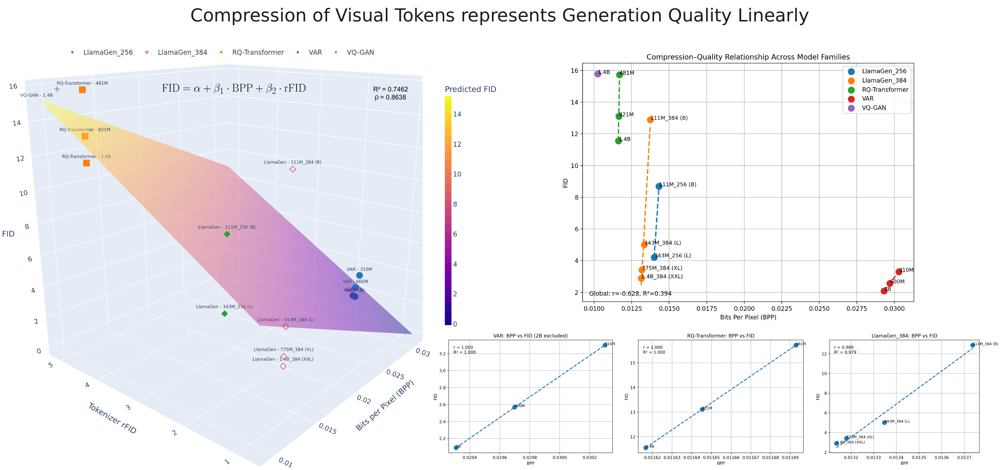
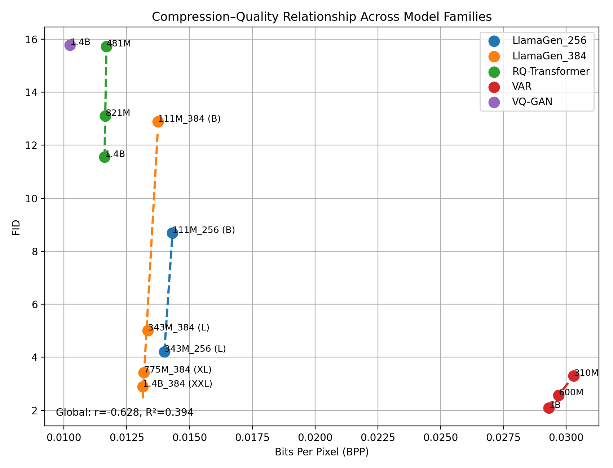
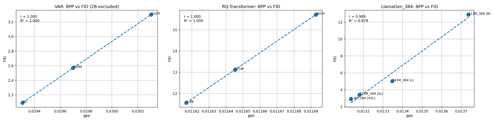
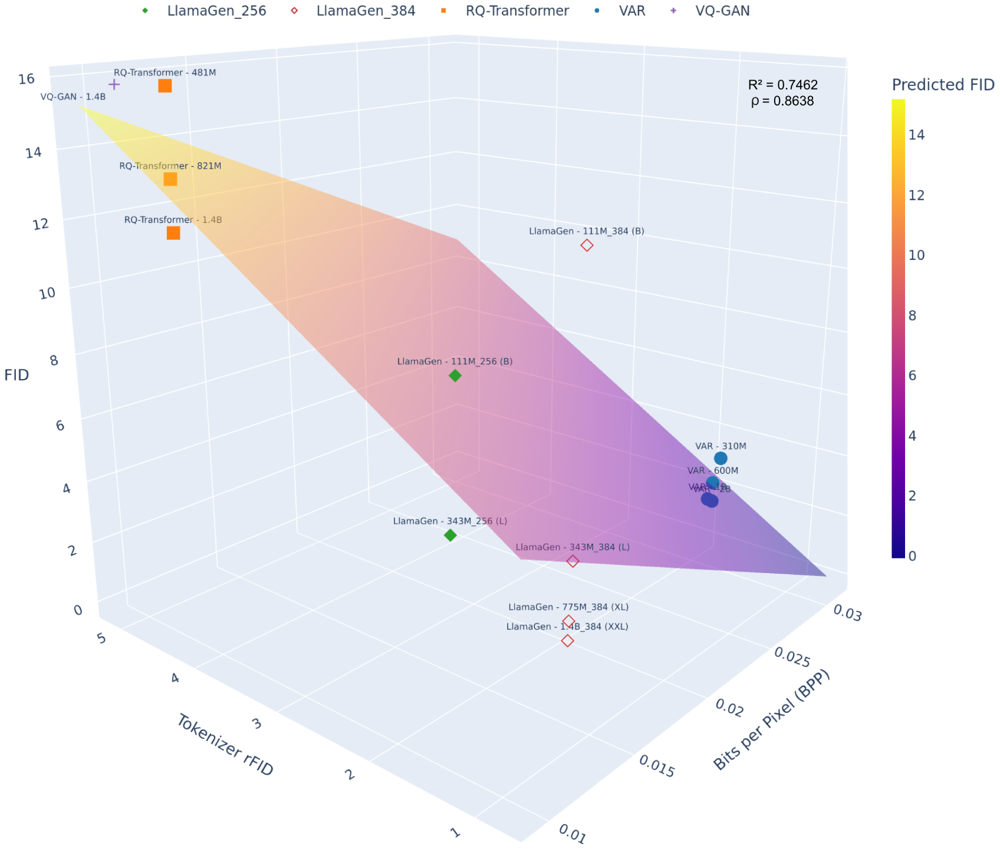

# Compression of Visual Tokens Represents Image Generation Quality Linearly
Constantinos Theofylaktou*, Georgios Vamvouras*, Giannis Tsakalis*, Konstantinos Leontiadis* (*Equal contribution)

Recent work in language modeling has demonstrated strong scaling relationships between compression efficiency and downstream performance ([Compression Represents Intelligence Linearly](https://github.com/hkust-nlp/llm-compression-intelligence.git)), raising the question of whether similar principles apply to image generation systems. This work investigates the relationship between compression, tokenizer reconstruction ability, and generative quality across a diverse set of image generative models.

## Building the project
From the root of the project, run the `make` command to invoke the Makefile. This will:
 + Install dependencies from `requirements.txt`.
 + Clone the dependencies for other model implementations.
 + Download the ImageNet dataset (for validation)
 + Download model checkpoints
  
Note: due to the large size of these dependencies, the build is expected to take a lot of time. You can also see the `Makefile` and do the setup manually.

## Running the project
To evaluate compression for a **single** model run:

`python3 main.py single <ModelType> <ModelSize> <BatchSize>`

(Note: valid values for `ModelType`, `ModelSize` can be found in the `MODEL_SIZES` dictionary in `util.py`.)

To evaluate the compression for **all** models run:

`bash runner.sh`

The results can then be found in the `results` directory. Model FIDs and Tokenizer RFIDs are pre-computed by the model creators and documented in their respective repositories.

## Results

| Model Type      | Model Size            | FID | rFID | BPP |
|-----------------|-----------------------|-----|------|-----|
| [VQGAN (Taming Transformers)](https://github.com/CompVis/taming-transformers.git)          | 1.4B                  |  15.78   |   4.98   |  0.0102383   |
|                 |                       |     |      |     |
| [RQ-Transformer](https://github.com/kakaobrain/rq-vae-transformer.git)  | 481M                  |  15.72  |  4.73   | 0.0116929   |
|                 | 821M                  |  13.11   |  4.73    |  0.0116453   |
|                 | 1.4B                  | 11.56     | 4.73      |  0.0116167    |
|                 |                       |     |      |     |
| [LlamaGen](https://github.com/FoundationVision/LlamaGen.git)        | 111M_256 (B)          |   8.69  |  2.19    | 0.0143224    |
|                 | 111M_384 (B)          |  12.89   |    0.94  |  0.0137373   |
|                 | 343M_256 (L)          |   4.21  |   2.19   |  0.0139988   |
|                 | 343M_384 (L)          |   5.01  |    0.94  |  0.0133479   |
|                 | 775M_384 (XL)         |    3.42 |    0.94  |  0.0131801   |
|                 | 1.4B_384 (XXL)        |2.89| 0.94     | 0.0131356    |
|                 |                       |     |     |     |
| [VAR](https://github.com/FoundationVision/VAR.git)             | 310M                  | 3.30    |   1.78   |   0.0303021  |
|                 | 600M                  |   2.57  |   1.78   |  0.0296986   |
|                 | 1B                    |   2.09  |   1.78   |  0.0293080   |
|                 | 2B                    |   1.92  |   1.78   |  0.0297070   |

ANCOVA analysis of the results groupped within architectures show the following:
| Model Type           | Number of Models | Slope   | R²     | Pearson $ρ$ |
|------------------|------------------|---------|--------|---------------------|
| [LlamaGen](https://github.com/FoundationVision/LlamaGen.git)-384     | 4                | 16798.9 | 0.979  | 0.989               |
| [RQ-Transformer](https://github.com/kakaobrain/rq-vae-transformer.git)   | 3                | 54590.6 | 0.999| 0.999             |
| [VAR](https://github.com/FoundationVision/VAR.git)              | 4                | 1277.7  | 0.719  | 0.848               |

Further analysis showed that a bilinear model $\text{FID} = α + β_0\cdot\text{BPP} + β_1\cdot\text{rFID}$ increased global $R^2$ from 0.446 to 0.746 compared to the simple linear model $\text{FID} = α + β\cdot\text{BPP}$, with the rFID coefficient being statistically significant (p < 0.05). This demonstrates that tokenizer reconstruction quality explains a substantial fraction of image quality variation that cannot be attributed to compression alone.

## Conclusion
+ Compression efficiency presents a strong linear correlation with image quality, but only when the tokenizer is fixed.
+ Different architectures exhibit fundamentally different scaling laws, invalidating a universal compression-quality relationship.
+ Tokenizer rFID is an independent and significant predictor of image quality.
+ A bilinear model combining BPP and rFID provides the most accurate description of observed behavior.

### Licenses
This repository’s [LICENSE](LICENSE) applies only to original code in this repository.
Third-party code and pretrained models are subject to their [respective licenses](THIRD_PARTY_LICENSES.md).
